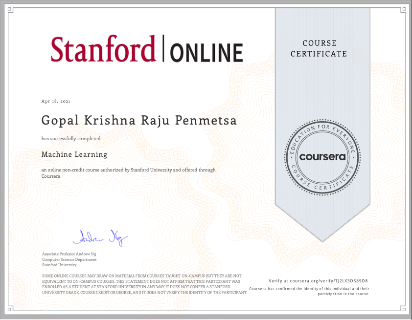

# Machine Learning

This repo contains the course work done as part of completing coursera's [Machine Learning](https://www.coursera.org/learn/machine-learning) by Andrew Ng

This course provides a broad introduction to machine learning, datamining, and statistical pattern recognition. 

Topics include: 
1. Supervised learning (parametric/non-parametric algorithms, support vector machines, kernels, neural networks). 

2. Unsupervised learning (clustering, dimensionality reduction, recommender systems, deep learning). 

3. Best practices in machine learning (bias/variance theory; innovation process in machine learning and AI). 

The course also draws from numerous case studies and applications, so that you'll also learn how to apply learning algorithms to building smart robots (perception, control), text understanding (web search, anti-spam), computer vision, medical informatics, audio, database mining, and other areas.

## Resources

Video Lectures : [youtube](https://www.youtube.com/playlist?list=PLLssT5z_DsK-h9vYZkQkYNWcItqhlRJLN)

Coursera : [Machine Learning](https://www.coursera.org/learn/machine-learning)

## Final Certificate

> **Note**: To comply with Academic Honesty **DO NOT** use the code for coursework.